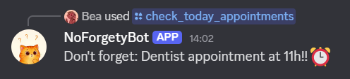

# NoForgetyBot
A Discord bot to send daily reminders. Don't forget stuff with **NoForgetyBot**!

## General info 🐱
This bot is developed in **Python**.

To register any appointment, interact with the bot through Discord. Your appointments will be saved in the following **files**, according to their type:
- *appointments.json*
- *birthdays.json*

The **.env** file is where your bot private variables are stored:
- APP_ID
  - In the *General Information* tab of your Discord bot's developer page, copy the *Application ID* shown.
- DISCORD_TOKEN
  - Go to the *Bot* tab of your Discord bot's developer page;
  - Click the *Reset Token* button and copy the token shown.
- PUBLIC_KEY
  - In the *General Information* tab of your Discord bot's developer page, copy the *Public Key* shown.
- CHANNEL_ID
  - Enable Developer Mode by going to the gear icon, then *Advanced settings*;
  - Once enabled, right-click the desired channel's name and select *Copy Channel ID*.

## Available commands 🎮
This bot allows the following actions in your Discord server:
- Add an appointment
- Check today's appointments
- List all appointments
- Remove an appointment

For a more friendly interaction, you can also specifically register **birthdays**:
- Add a birthday
- Check today's birthdays
- List all birthdays
- Remove a birthday

*Note:* For example, if you want to check today's appointments, simply type **/check_today_appointments** on the server chat and the bot will reply:

## How to run 🏃‍♀️‍➡️
To get the bot running, simply type **./run** in the command line!